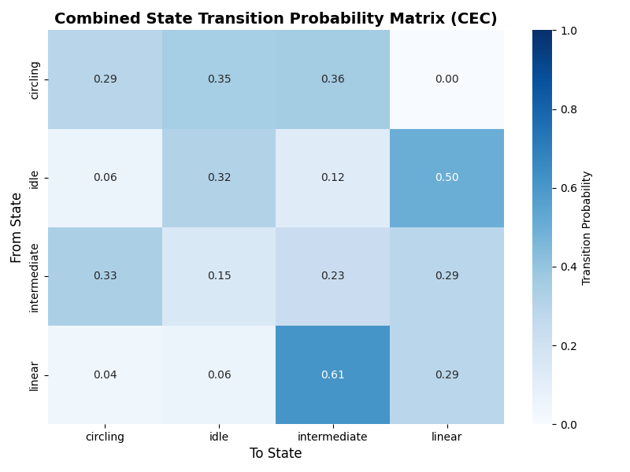

## Xenobot Transition State Analysis

Refurbished pipeline for analyzing changes in xenobot movement after applying stimulus.



### Description

Taking time-lapse videos of xenobot movements over long periods of time, their movement
coordinates are tracked and recorded. Each video is divided up into 30-second chunks, and metrics
such as linear speed, heading, and angular speeds are measured to allow for analysis. This
data is then used to categorize each timestamp into a specific movement state: linear, circular, or
idle.

### Getting Started
Fork the repository, open up VS Code, and clone the repository you had just forked.
This should open up the repository on your VS Code. 

**Dependencies**
Make sure to download Python3.12 on your device.
Open up a terminal window and run the following commands.
For MacOS, it's the following command (assuming you have HomeBrew).
```
brew install Python3.12
```

Set Up a Local Python Environment
```
cd movement_visualizer
```
```
python3.12 -m venv .venv
```
Activate the Python environment.
```
source .venv/bin/activate
```
Download the required dependencies to run these files.
```
pip install -r requirements.txt
```

### Executing program

**How to run the pipeline:**
* use Noldus software to track and output the CSV file with tracking data from your xenobots
* this tutorial assumes that you have a single xenobot for each CSV file
* modify the main function so that the *file_paths* array holds all the file paths to your csv data
```
file_paths = [
    '/Users/yuxin/Desktop/xenobots/sample_data/sample_mixed_1.csv',
    '/Users/yuxin/Desktop/xenobots/sample_data/sample_mixed_2.csv',
    '/Users/yuxin/Desktop/xenobots/sample_data/sample_mixed_3.csv',
    '/Users/yuxin/Desktop/xenobots/sample_data/sample_mixed_4.csv',
    '/Users/yuxin/Desktop/xenobots/sample_data/sample_mixed_5.csv',
    '/Users/yuxin/Desktop/xenobots/sample_data/sample_mixed_6.csv',
    '/Users/yuxin/Desktop/xenobots/sample_data/sample_mixed_7.csv',
    '/Users/yuxin/Desktop/xenobots/sample_data/sample_mixed_8.csv'
]
```
* the function **load_data** will extract the appropriate columns with data & convert the velocity metrics
from minutes to seconds
* in the **main** function, replacing all of the file paths with the file paths of your own CSV files
* run the following commands to return visuals
```
cd movement_visualizer
```
```
python main.py
```

### Help

Please contact me at yu.zeng@tufts.edu for any issues or concerns.

### Authors

Contributors names and contact info

* author: [Yuxin Zeng](https://www.linkedin.com/in/yuxzeng/)
* principle investigator: [Vaibhav Pai](https://www.linkedin.com/in/paivaibhav/)
* algorithm developer: [Simon Garnier](https://www.linkedin.com/in/simongarnier/)

### Acknowledgments

Inspiration, code snippets, etc.
* [A cellular platform for the development of synthetic living machines](https://www.science.org/doi/10.1126/scirobotics.abf1571)
